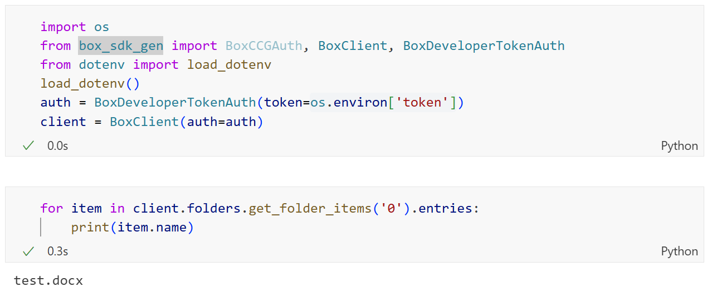
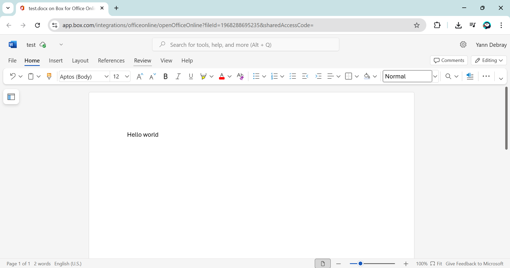
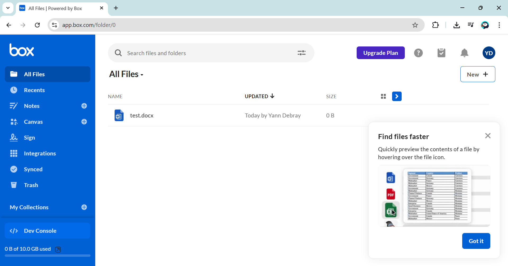
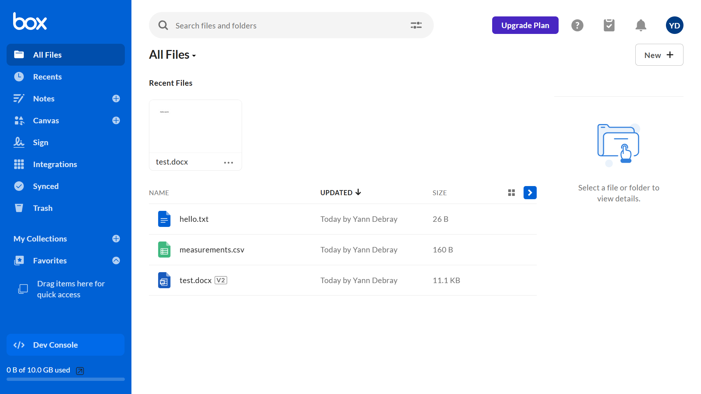

# Call Box from Python 📦🐍



## Getting started


### 1. List files

Create a new file manually





```python
# 1) List items in root folder ("0")
items = client.folders.get_folder_items(folder_id="0", limit=100)
for entry in items.entries:
    print(entry.type, entry.id, entry.name)
```
```
test.docx
FileBaseTypeField.FILE 1968288695235 test.docx
```


### 2. Download files

https://github.com/box/box-python-sdk-gen/blob/main/docs/downloads.md

```python
# 2) Download a file by id
file_id = entry.id
with open(entry.name, "wb") as out:
    with client.downloads.download_file(file_id=file_id) as stream:
        out.write(stream.read())
```

### 3. Upload files

https://github.com/box/box-python-sdk-gen/blob/main/docs/uploads.md
```python
# 3) Upload a local file into a folder (here root "0")
from box_sdk_gen import UploadFileAttributes, UploadFileAttributesParentField
with open("measurements.csv", "rb") as f:
    uploaded = client.uploads.upload_file(UploadFileAttributes(
        name="measurements.csv", parent=UploadFileAttributesParentField(id="0")
    ), file=f)
```

```python
# 3b) Download a file uploaded by id
file_id = uploaded.entries[0].id
with open("measurements.csv", "wb") as out:
    with client.downloads.download_file(file_id=file_id) as stream:
        out.write(stream.read())
```

```python
# 3c) Create/overwrite a small text file from memory
from io import BytesIO
buf = BytesIO(b"hello from Python via Box!")
buf.seek(0) # Make sure we're at the start
created = client.uploads.upload_file(
	attributes={
		"name": "hello.txt",
		"parent": {"id": "0"}
	},
	file=buf
)
print("Created:", created.entries[0].id, created.entries[0].name)
```



## Resources

* https://developer.box.com/guides/authentication/client-credentials/client-credentials-setup/
* https://github.com/box/box-python-sdk-gen
* https://developer.box.com/sdks-and-tools/